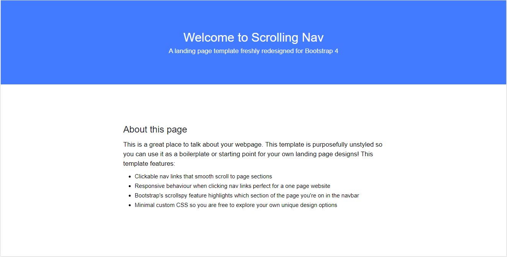
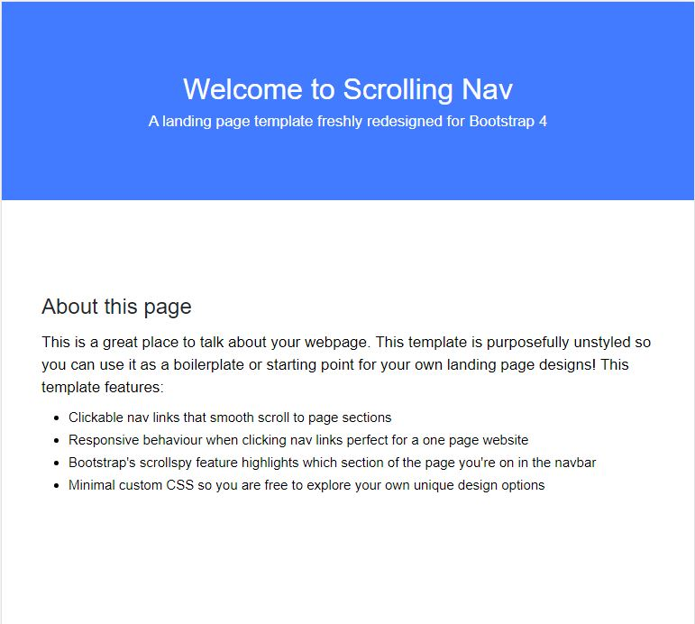
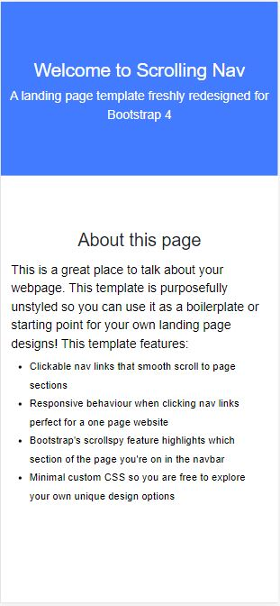

# about-page
This is a task from Uncle BB and friends challenge 2

# Uncle BigBay and friends - About page Solution


## Table of contents

- [Overview](#overview)
  - [The challenge](#the-challenge)
  - [Screenshot](#screenshot)
  - [Links](#links)
- [My process](#my-process)
  - [Built with](#built-with)
  - [What I learned](#what-i-learned)
  - [Continued development](#continued-development)
  - [Useful resources](#useful-resources)
- [Author](#author)
- [Acknowledgments](#acknowledgments)


## Overview

### The challenge

Users should be able to:
- View the about page
- View the optimal layout for the site depending on their device's screen size

### Screenshot






### Links

- Solution URL: [Github](https://github.com/Austinet/about-page.git)
- Live Site URL: [Live site](https://austinet.github.io/about-page/)

## My process

### Built with

- Semantic HTML5 markup
- CSS custom properties
- Laptop-first workflow
- Visual Studio Code


### What I learned


```html
<div>
  <h2> About this page </h2>
  <p> This is a ...    </p>
</div>
```
```css
 body{
   width:100%;
   height:100vh;
   background:#fff;
 }

```

### Continued development

Keep taking up projects and keep improving

### Useful resources

- [ Youtube](https://www.Youtube.com) 
- [Google  ](https://www.Google.com) 

## Author

- Frontend Mentor - [@austinet](https://www.frontendmentor.io/profile/austinet)
- Twitter - [@udhe.austine](https://www.twitter.com/udhe.austine)


## Acknowledgments

I will like to acknowledge God for giving me the grace to keep up with the good work.And also thanking my colleagues at Uncle BB and friends. And also Google, Youtube and ctrl+z lol.
